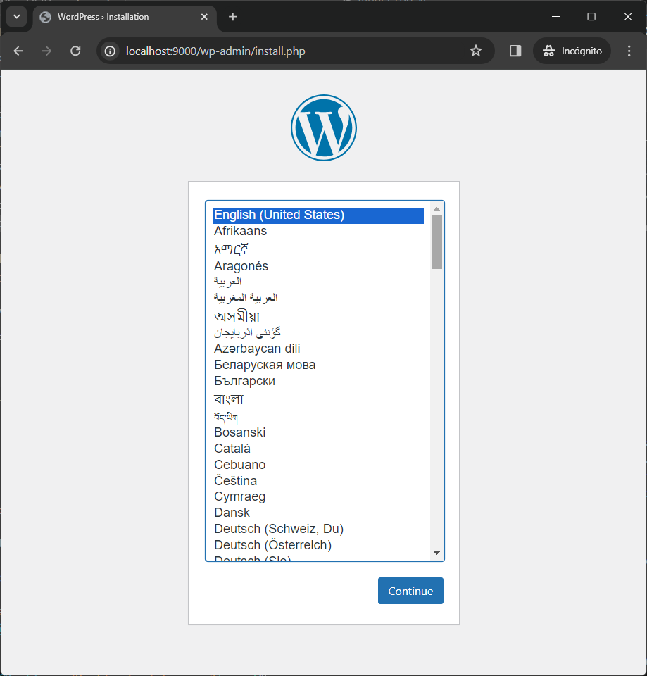

# Instructions

### Download the image from dockerhub
```
PORT=9000
docker run --detach --privileged -p $PORT:8080 wilrojasf/wordpress
```

### OR Build the image from this Repository
1. Build the image
    ```
    docker build -t wordpress:dind -f ./Dockerfile .
    ```
2. Create a container(s)
    ```
    PORT=9000
    docker run --detach --privileged -p $PORT:8080 wordpress:dind
    ```
    Images will be pulled inside the container, so **it will take a moment** until the page is available on the **selected port**. </br>
    
    Access it via "http://localhost:PORT" or "http://host-ip:PORT" in a browser:    
    

